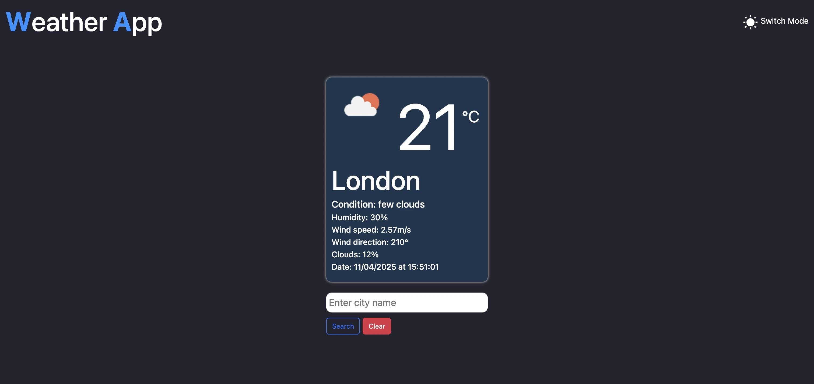

# 100-Days-of-Code - My Journey

**Start Date:** April 09, 2025.
**Main Goal:** Code for 100 days, track progress, and build real-world skills.

# Introduction 

I started learning to code / programme since 17th of November 2024. I have built little projects to reinforce what I have learnt and have pushed these projects to my github, you can view my <a href='https://github.com/decencyokobia?tab=repositories' target='_blank' title="decency's github repositories">repositories</a>. I have created this repository to document my #100DaysOfCode challenge. Wish me luck! Let's go!

# Day 1 - April 09, 2025.

After sometime I have finally built my own website by refactoring a ready-made template to get my website up and running as well as learn how to modify other people's code and not causing a bug or break in the architecture. My website has an about me section, portfolio, blog and contact pages. I had a great time costomizing it to my own taste. Also I had started learning react since 16th March 2025, so i have created a todolist and an expense tracker multiple times and also learnt how to useState, useEffect (but likely in API request and also tracking changes in my todolist and expense tracker for localstorage purposes) and building reusable UI components (main purpose of react as a javascript library). Since i had to put these on my portfolio, had to learn how to host react projects on github via gh-pages. Finally hosted both after long hours of googling and asking chatGPT questions. It was quite simple when i was doing the next one after the first. 

**learning point:-** 

1. Website creation
2. Build and deployment of react + typescript projects
3. Implementation of localstorage to store todolist and expense tracker data.

**Challenges:**

It was all good stuff all the way. I had challenges while trying to make my react projects live and had to work with JSON files to make that the strict and homepage was all configured to build and deploy my react project. Even after i had finished, I went back to rebuild the todolist and expense tracker to implement localstorge and also configure the files for deployment whuch was a little bit challenging but this time i forced my brain to recall and understand why i had to make what and what. 

**Reflection:-** 

The most interesting part of my journey so far is that 5 months ago, I didn't know how the web worked and now I have started to figure something out and makes me want to learn more. I am excited about learning more about APIs, handling more complex state management in React and soon Next.js to build beautiful web applications.

**Goal:-**

My next goal will be to refresh my mind on how to fetch data with axios using weatherApi free apikey. Hopefully this week and finish my course on how to build a video game fetching app using chakra, but trust me I am taking it slowly as this is the best way I assimilate things.

# Day 2 - April 10, 2025.

Today has been a successful day for me, and I hope the same for you! It's Day 2 of #100DaysOfCode, and I’ve managed to develop a mini weather app. It's not deployed yet, but that's my goal for tomorrow. Aside from coding and developing my technical skills, I've also been focusing on improving my time management. I realized I could easily spend the whole day on my laptop, especially after eating and showering. I tend to avoid distractions like video games, which is a good thing, but I want to strike a better balance.

I came across a concept called the 8-8-8 rule: 8 hours of work, 8 hours of sleep, and 8 hours of leisure with family or friends, or anything non-work related. I didn't fully implement it today, but it's something I'm working towards. Anyway, back to the weather app I built. I’ll share my key takeaways, challenges, reflections, and goals under the following headings:

**learning point:-** 

1. Axios & useEffect:
Axios is a popular library in React used to fetch data, similar to the fetch API in vanilla JavaScript. I’ve used Axios before, so I’m familiar with how to fetch data and handle errors in the console. useEffect is a React hook used to manage side effects, like fetching data. Today, I managed to structure my app by creating a services folder with an api-client.ts and an apiKey.ts file. This modular approach helped keep things clean and organized.

2. AbortController:
This was a new concept for me. The AbortController is used to cancel HTTP requests, which helps prevent unwanted re-renders or remounting due to React's strict implementation. I used it to signal the request cancellation once the data was fetched, making my app more efficient.

3. Weather Icons:
Initially, I thought I’d just hardcode icons based on the weather type. But then, I realized I could use an array to store the icons and dynamically reference them using the index. This was a simple array iteration concept, but with React, I didn’t have to manually loop through as I would in vanilla JavaScript. Also, I learned how to use as keyof typeof for arrays, which helps avoid undefined errors when indexing.
   
**Challenges:**

I encountered some challenges fetching the data today, despite having worked with APIs before. Each API structure is different, so it took a bit of trial and error to map my data correctly. Some responses were arrays of objects, others were objects containing arrays and other objects. I quickly realized that logging the response in the console was essential for understanding the structure and ensuring I defined the correct props. It was a bit frustrating at times, but ultimately, I made it work, and that’s what matters. 

**Reflection:-** 

Looking back, I would make sure to study the structure of the data before trying to fetch it, to better align my props with how the data is structured. There’s always room for improvement, but I’m proud of the progress I made today. One of the highlights was using React Hook Form and Bootstrap to create a dynamic input field, which allowed me to change the city in the weather app without hardcoding values. I had a similar experience while working on my expense tracker project, so it felt great to apply what I learned in one project to another seamlessly. To me, programming is all about taking an idea, explaining it clearly (even to yourself), and then implementing it with the right tools. If you can break it down, you can build it.

**Goal:-**

My next goal is to deploy the weather app and refine it a bit before pushing it to GitHub Pages. I’m not focusing too much on UI/UX right now, but I’ll make sure to fine-tune it tomorrow before the deployment. I’ve also got my MSc project to consider, but for now, I’m staying motivated and pushing forward. No giving up!

# Screenshot of the weather app

# Day 3 - April 11, 2025.

Today I focused on improving the UX/UI of my weather app. I implemented local storage for better state persistence and added a toggle for switching between light and dark modes. I also moved away from a static array of weather icons and instead now fetch icons dynamically from the API — way cleaner and more efficient. 

**learning point:-** 

A big highlight was learning how to fetch temperature values directly in Celsius using API parameters, which saved me from doing manual math conversions. I also got deeper into error handling, learned to interpret console responses more effectively, and implemented a custom alert system.

<a href='https://decencyokobia.github.io/weather-app/' title='my weather app link for live demo'>Access my weather app here</a>

**Challenges:**

Today wasn’t too challenging compared to yesterday. The only hiccup was figuring out how to separate API calls from the rest of the app structure — specifically creating a custom hook for HTTP requests, error handling, and loading states. I didn’t Google anything; just tried to jog my memory and experiment through trial and error. Eventually, I nailed it: separated the API key, created a custom hook, and got it all working smoothly.

**Reflection:-** 

Honestly, I’m proud of how far I’ve come. I’m especially happy that everything is functional and that I was able to cleanly separate concerns in my code — HTTP requests are no longer tangled into my main app logic. That feels like a solid dev move and a step in the right direction toward writing more scalable, maintainable code.

**Goal:-**

Next up, I want to wrap up my video game fetching app as part of my course. Not gonna lie, I find following tutorials a bit boring lately, but I’m pushing through because I know it’s all part of the process. The goal is to complete it so I can finally move on to learning and building with Next.js — I’m hyped about building more robust, full-stack applications.

Also, on the content front: I’ve started posting on Twitter daily, aiming for 2–3 times a week on LinkedIn, and once a week on my blog. My GitHub logs will continue daily — no excuses, even on workdays.

# Day 4 - April 12, 2025.

Today was a mixed bag. I started the day with a clear set of goals: add a filter to my todo list, implement a clear button, add a date to my expense tracker, attempt a progress bar or pie chart, ensure everything used local storage, and work on my recipe app. Sadly, I didn’t touch the video app at all—feeling a bit bad about that, but hey, I’m just a tired man trying to make it. 😅

**learning point:-** 

The highlight was the recipe app. I integrated the Spoonacular API and had to dive into the documentation, which turned out to be a great learning experience. I haven’t done much UI-wise yet, but I did manage to set up an input field that dynamically changes the recipe based on user input—pretty much using the same logic as my weather API and expense tracker. And it worked! Always feels good when the logic holds up.

**Challenges:**

Today hit me with some roadblocks. I really wanted to figure things out myself without jumping straight to Google, and while that helped me learn, it also slowed me down. I couldn’t get the filter on the todo list to work, no matter what logic I tried. The only thing I successfully implemented was the clear button, so I focused on that, updated the UI, uploaded the new screenshot to my website, and made sure everything was synced with GitHub.

I also added the date feature to my expense tracker—thankfully, that was smooth sailing since I’ve worked with the Date object before. I tried to implement a progress bar or pie chart for the tracker too, but it just didn’t look right. So I pushed what I had and updated my site. Definitely felt a bit frustrated not hitting all my goals today.

**Reflection:-** 

Not gonna lie—I felt a bit rubbish not being able to implement the filter or the progress bar. It had me questioning myself like, “Do I even know what I’m doing?” 😅 But on the flip side, getting the recipe app to fetch properly was a win. Small victories, right?

Oh, and I finally set up my Upwork account! Everything’s ready to go, but imposter syndrome is hitting hard. Still doesn’t feel like I’m "ready" to take on gigs, but I guess we’ll see in the coming weeks. One step at a time—we keep pushing.

**Goal:-**

Top priority is to figure out how to implement that filter on the todo list and properly display a progress bar or chart on the expense tracker. I also want to finish my React course, especially the section on fetching video games, so I don’t waste more time stuck in the same spot. Keeping it moving, one day at a time.

# Day 5 of 100 — April 13, 2025

Five days in, and I’m genuinely enjoying the process. It hasn’t been all smooth sailing — a few bumps here and there — but I’m taking every hiccup as a chance to learn.

Yesterday, I struggled to implement a filter, but today I cracked it, thanks to ChatGPT! Turns out it’s not that different from the kind of filters I’ve used in my expense tracker. I just didn’t make the connection immediately because, well… I’m still pretty new to this. 😅

But with a bit of hands-on practice (and no copy-pasting — I’m trying to really learn), I managed to make it work. I want to be able to do this stuff on my own tomorrow, without looking clueless.

During the workweek, I usually practice on the bus to and from work. It’s actually a great way to reinforce what I’ve learned. Hopefully, it becomes second nature soon.

I also started exploring the chart.js library. I want to be able to use charts like line, bar, and pie charts for future projects — especially for something like an admin dashboard. I was able to render a component using hardcoded data, but doing it dynamically is the real goal. More practice needed!

**Learning Points:**

Here’s what I learned while implementing a filter:

1. Store the original array in a state. For me, that was todos[].

2. Create a separate state to store the filter condition. I used filter, initialized to 'all', and restricted it to <‘all’ | ‘active’ | ‘completed’>.

3. Render conditionally based on the filter, like this:

const displayTodos = todos.filter(todo => {
  if (filter === 'active') return !todo.complete;
  if (filter === 'completed') return todo.complete;
  return true; // for 'all'
});

This displayTodos is what gets rendered in the UI. Understanding this flow has been a win for me, and I’ll keep practicing it until it clicks fully.

**Challenges:**

With charts, I only managed to get the basics — installed the libraries using:

npm i chart.js react-chartjs-2

Then imported the components I needed (e.g. Line, Bar, Pie) and registered them using:

ChartJS.register(...);

But if I’m being honest, I still don’t fully know what I’m doing here. 😅 It’s a work in progress. But hey — everything I know now once felt like this, so I’m hopeful.

**Reflection:**

I’m proud of my progress so far. My plan is to go deeper into the chart.js docs and strengthen my grasp on the filter logic. Most of all — I’m enjoying the journey.

**Goals:**

I'm on night shifts all week, so I’m not expecting a huge amount of progress. That said, I do have a 300-word research proposal to submit on the 17th. Thankfully, I’ve already done half through group discussions, so it shouldn’t be too difficult to complete.

I also need to finish some online modules before they expire. Staying ahead of deadlines is key — I’d rather not have my manager chasing me down. 😅

For coding, I’ll focus on reviewing everything I’ve learned this week during my bus rides and maybe during night shifts (if my brain cooperates). My laptop is always with me — so I’ll do what I can.

I’ll keep posting my logs and updates on Twitter, even if they’re small. For my blog and LinkedIn, I’ll aim to post weekly — I’d rather deliver quality over quantity. As for YouTube, I’m not quite bold enough for video yet, but… who knows what the future holds?

Thanks for reading. 🙌

# Day 6 of 100 — April 14, 2025

Today marked the start of my night shifts, so I spent part of the day prepping my scrubs and mentally preparing for the usual busyness of the ICU. On the tech side of things, I made progress on my recipe app by successfully adding clickable links to the search results.

In case I hadn’t mentioned it earlier, this recipe app uses the Spoonacular API, and it's one of several small projects I'm working on to reinforce my learning and really solidify the core concepts. Doing this alone isn't always easy—it can feel like a lot—but I’m committed to pushing through.

The project is now live on GitHub, though I still plan to iterate on it to improve the user experience—especially when it comes to how users search for and interact with recipes.

**Learning Points:**

I shared the app with a friend who asked, “Are the recipe images clickable?” At first, they weren’t—but that got me thinking. It would be much better if users could click a recipe and get more detailed information, like cooking instructions or ingredients.

After a quick shower, I turned to ChatGPT and asked whether the Spoonacular API supported this. It did! With some extra parameters added to the existing endpoint, I was able to pull in more detailed data. Revisiting the documentation helped clarify things, and implementing the change became the highlight of my Day 6.

I’ve also been thinking about expanding my weather app—but I’ll probably tackle that next week. Once my work week kicks in, I usually only have the energy to review past work and do light coding.

click on the image to view my project:

**Challenges:**

This update wasn’t particularly difficult—just a matter of tweaking the API request with the correct parameters. I also created a .env file to hide my API key and added it to .gitignore for better security. One limitation of the Spoonacular free tier is the 150-request daily cap, but that’s expected with free APIs.

**Reflection:**

Going forward, I’ll make it a point to think like a user when building any project. Listing out potential user questions in advance and trying to address them before deployment should help build more robust and intuitive apps.

**Goals:** 

Despite a busy shift—including admitting a post-op patient from plastics—I managed to squeeze in some e-learning. I’ll aim to continue that tonight and maybe review some code on my commute home. I couldn’t do much last night since I drove (ended up just having KFC, haha), but once I get a quieter night, I’ll post updates on Twitter.

Busy or not, we keep going. Let’s see what tomorrow brings.

# Day 7 of 100 — April 15, 2025

Day 7 was light in terms of coding, as expected, due to a busy night at work. Still, I made the most of my break and bus ride home to sneak in some progress—which I’m proud of.

**Learning Points:** 

I explored the OpenWeather API and learned how to retrieve real-time hourly forecasts. While the hourly data requires a paid plan, the free 5-day / 3-hour forecast suits my needs for now. My goal is to mimic the experience of a typical weather app while adding unique features that I’ll reveal once complete.

I’m being intentional about building something valuable without incurring too many costs, so that users can access a high-quality experience for free.

**Challenges:** 

No issues with data fetching or UI rendering so far—I’ve gotten pretty comfortable working with APIs like Spoonacular and OpenWeather, using tools like Axios and Postman to inspect and test endpoints.

My main challenge is managing time and energy, especially balancing work with this 100-day challenge. My goal is to code at least one hour a day, even if it’s just 30 minutes when I’m drained. A little progress every day adds up.

**Reflection:**

This challenge is reinforcing the value of consistency over intensity. Even 2 minutes of effort is better than zero. I’m learning to appreciate small wins and trust the compounding effect of showing up daily.

**Goals:** 

<ul>
<li>Finalize the new UI for the weather app</li>

<li>Use design inspiration from Dribbble to enhance user experience and visual appeal</li>

<li>Pace myself through the night shifts and spread work across the week</li>
</ul>