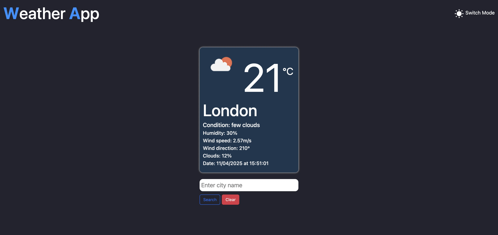
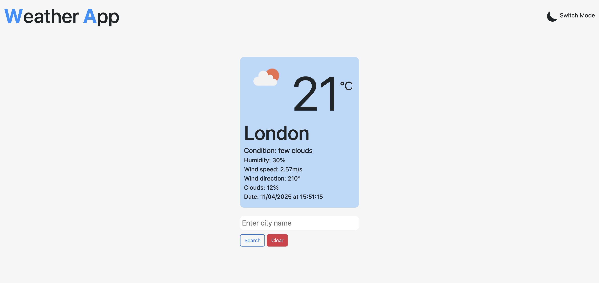
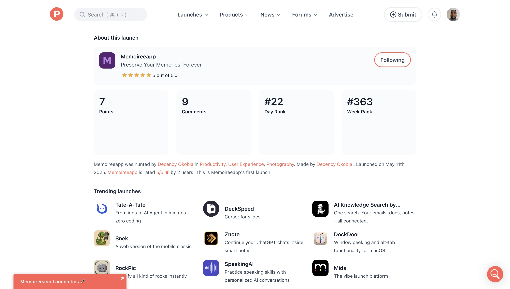
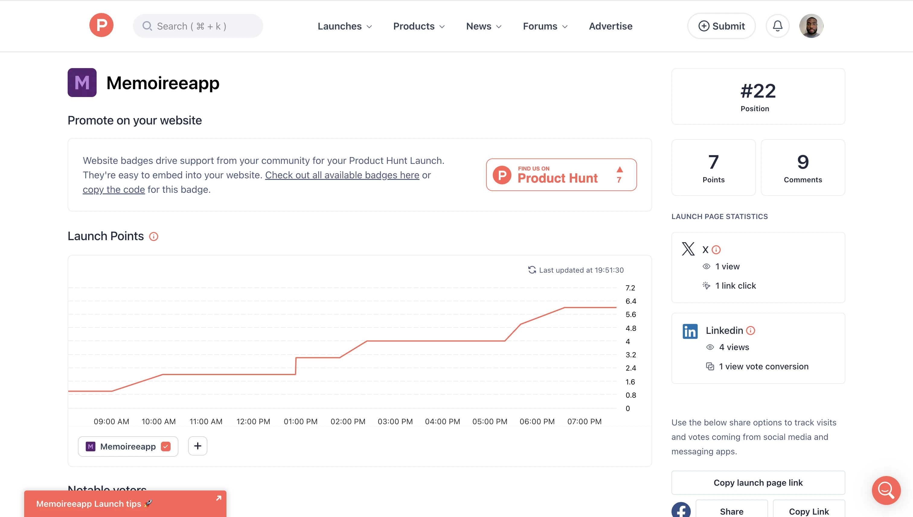

# 100-Days-of-Code - My Journey

**Start Date:** April 09, 2025.
**Main Goal:** Code for 100 days, track progress, and build real-world skills.

# Introduction

I started learning to code / programme since 17th of November 2024. I have built little projects to reinforce what I have learnt and have pushed these projects to my github, you can view my <a href='https://github.com/decencyokobia?tab=repositories' target='_blank' title="decency's github repositories">repositories</a>. I have created this repository to document my #100DaysOfCode challenge. Wish me luck! Let's go!

# Day 1 - April 09, 2025.

After sometime I have finally built my own website by refactoring a ready-made template to get my website up and running as well as learn how to modify other people's code and not causing a bug or break in the architecture. My website has an about me section, portfolio, blog and contact pages. I had a great time costomizing it to my own taste. Also I had started learning react since 16th March 2025, so i have created a todolist and an expense tracker multiple times and also learnt how to useState, useEffect (but likely in API request and also tracking changes in my todolist and expense tracker for localstorage purposes) and building reusable UI components (main purpose of react as a javascript library). Since i had to put these on my portfolio, had to learn how to host react projects on github via gh-pages. Finally hosted both after long hours of googling and asking chatGPT questions. It was quite simple when i was doing the next one after the first.

**learning point:-**

1. Website creation
2. Build and deployment of react + typescript projects
3. Implementation of localstorage to store todolist and expense tracker data.

**Challenges:**

It was all good stuff all the way. I had challenges while trying to make my react projects live and had to work with JSON files to make that the strict and homepage was all configured to build and deploy my react project. Even after i had finished, I went back to rebuild the todolist and expense tracker to implement localstorge and also configure the files for deployment whuch was a little bit challenging but this time i forced my brain to recall and understand why i had to make what and what.

**Reflection:-**

The most interesting part of my journey so far is that 5 months ago, I didn't know how the web worked and now I have started to figure something out and makes me want to learn more. I am excited about learning more about APIs, handling more complex state management in React and soon Next.js to build beautiful web applications.

**Goal:-**

My next goal will be to refresh my mind on how to fetch data with axios using weatherApi free apikey. Hopefully this week and finish my course on how to build a video game fetching app using chakra, but trust me I am taking it slowly as this is the best way I assimilate things.

# Day 2 - April 10, 2025.

Today has been a successful day for me, and I hope the same for you! It's Day 2 of #100DaysOfCode, and I’ve managed to develop a mini weather app. It's not deployed yet, but that's my goal for tomorrow. Aside from coding and developing my technical skills, I've also been focusing on improving my time management. I realized I could easily spend the whole day on my laptop, especially after eating and showering. I tend to avoid distractions like video games, which is a good thing, but I want to strike a better balance.

I came across a concept called the 8-8-8 rule: 8 hours of work, 8 hours of sleep, and 8 hours of leisure with family or friends, or anything non-work related. I didn't fully implement it today, but it's something I'm working towards. Anyway, back to the weather app I built. I’ll share my key takeaways, challenges, reflections, and goals under the following headings:

**learning point:-**

1. Axios & useEffect:
   Axios is a popular library in React used to fetch data, similar to the fetch API in vanilla JavaScript. I’ve used Axios before, so I’m familiar with how to fetch data and handle errors in the console. useEffect is a React hook used to manage side effects, like fetching data. Today, I managed to structure my app by creating a services folder with an api-client.ts and an apiKey.ts file. This modular approach helped keep things clean and organized.

2. AbortController:
   This was a new concept for me. The AbortController is used to cancel HTTP requests, which helps prevent unwanted re-renders or remounting due to React's strict implementation. I used it to signal the request cancellation once the data was fetched, making my app more efficient.

3. Weather Icons:
   Initially, I thought I’d just hardcode icons based on the weather type. But then, I realized I could use an array to store the icons and dynamically reference them using the index. This was a simple array iteration concept, but with React, I didn’t have to manually loop through as I would in vanilla JavaScript. Also, I learned how to use as keyof typeof for arrays, which helps avoid undefined errors when indexing.

**Challenges:**

I encountered some challenges fetching the data today, despite having worked with APIs before. Each API structure is different, so it took a bit of trial and error to map my data correctly. Some responses were arrays of objects, others were objects containing arrays and other objects. I quickly realized that logging the response in the console was essential for understanding the structure and ensuring I defined the correct props. It was a bit frustrating at times, but ultimately, I made it work, and that’s what matters.

**Reflection:-**

Looking back, I would make sure to study the structure of the data before trying to fetch it, to better align my props with how the data is structured. There’s always room for improvement, but I’m proud of the progress I made today. One of the highlights was using React Hook Form and Bootstrap to create a dynamic input field, which allowed me to change the city in the weather app without hardcoding values. I had a similar experience while working on my expense tracker project, so it felt great to apply what I learned in one project to another seamlessly. To me, programming is all about taking an idea, explaining it clearly (even to yourself), and then implementing it with the right tools. If you can break it down, you can build it.

**Goal:-**

My next goal is to deploy the weather app and refine it a bit before pushing it to GitHub Pages. I’m not focusing too much on UI/UX right now, but I’ll make sure to fine-tune it tomorrow before the deployment. I’ve also got my MSc project to consider, but for now, I’m staying motivated and pushing forward. No giving up!

# Screenshot of the weather app

# Day 3 - April 11, 2025.

Today I focused on improving the UX/UI of my weather app. I implemented local storage for better state persistence and added a toggle for switching between light and dark modes. I also moved away from a static array of weather icons and instead now fetch icons dynamically from the API — way cleaner and more efficient.

**learning point:-**

A big highlight was learning how to fetch temperature values directly in Celsius using API parameters, which saved me from doing manual math conversions. I also got deeper into error handling, learned to interpret console responses more effectively, and implemented a custom alert system.

**Challenges:**

Today wasn’t too challenging compared to yesterday. The only hiccup was figuring out how to separate API calls from the rest of the app structure — specifically creating a custom hook for HTTP requests, error handling, and loading states. I didn’t Google anything; just tried to jog my memory and experiment through trial and error. Eventually, I nailed it: separated the API key, created a custom hook, and got it all working smoothly.

**Reflection:-**

Honestly, I’m proud of how far I’ve come. I’m especially happy that everything is functional and that I was able to cleanly separate concerns in my code — HTTP requests are no longer tangled into my main app logic. That feels like a solid dev move and a step in the right direction toward writing more scalable, maintainable code.

**Goal:-**

Next up, I want to wrap up my video game fetching app as part of my course. Not gonna lie, I find following tutorials a bit boring lately, but I’m pushing through because I know it’s all part of the process. The goal is to complete it so I can finally move on to learning and building with Next.js — I’m hyped about building more robust, full-stack applications.

Also, on the content front: I’ve started posting on Twitter daily, aiming for 2–3 times a week on LinkedIn, and once a week on my blog. My GitHub logs will continue daily — no excuses, even on workdays.

# Day 4 - April 12, 2025.

Today was a mixed bag. I started the day with a clear set of goals: add a filter to my todo list, implement a clear button, add a date to my expense tracker, attempt a progress bar or pie chart, ensure everything used local storage, and work on my recipe app. Sadly, I didn’t touch the video app at all—feeling a bit bad about that, but hey, I’m just a tired man trying to make it. 😅

**learning point:-**

The highlight was the recipe app. I integrated the Spoonacular API and had to dive into the documentation, which turned out to be a great learning experience. I haven’t done much UI-wise yet, but I did manage to set up an input field that dynamically changes the recipe based on user input—pretty much using the same logic as my weather API and expense tracker. And it worked! Always feels good when the logic holds up.

**Challenges:**

Today hit me with some roadblocks. I really wanted to figure things out myself without jumping straight to Google, and while that helped me learn, it also slowed me down. I couldn’t get the filter on the todo list to work, no matter what logic I tried. The only thing I successfully implemented was the clear button, so I focused on that, updated the UI, uploaded the new screenshot to my website, and made sure everything was synced with GitHub.

I also added the date feature to my expense tracker—thankfully, that was smooth sailing since I’ve worked with the Date object before. I tried to implement a progress bar or pie chart for the tracker too, but it just didn’t look right. So I pushed what I had and updated my site. Definitely felt a bit frustrated not hitting all my goals today.

**Reflection:-**

Not gonna lie—I felt a bit rubbish not being able to implement the filter or the progress bar. It had me questioning myself like, “Do I even know what I’m doing?” 😅 But on the flip side, getting the recipe app to fetch properly was a win. Small victories, right?

Oh, and I finally set up my Upwork account! Everything’s ready to go, but imposter syndrome is hitting hard. Still doesn’t feel like I’m "ready" to take on gigs, but I guess we’ll see in the coming weeks. One step at a time—we keep pushing.

**Goal:-**

Top priority is to figure out how to implement that filter on the todo list and properly display a progress bar or chart on the expense tracker. I also want to finish my React course, especially the section on fetching video games, so I don’t waste more time stuck in the same spot. Keeping it moving, one day at a time.

# Day 5 of 100 — April 13, 2025

Five days in, and I’m genuinely enjoying the process. It hasn’t been all smooth sailing — a few bumps here and there — but I’m taking every hiccup as a chance to learn.

Yesterday, I struggled to implement a filter, but today I cracked it, thanks to ChatGPT! Turns out it’s not that different from the kind of filters I’ve used in my expense tracker. I just didn’t make the connection immediately because, well… I’m still pretty new to this. 😅

But with a bit of hands-on practice (and no copy-pasting — I’m trying to really learn), I managed to make it work. I want to be able to do this stuff on my own tomorrow, without looking clueless.

During the workweek, I usually practice on the bus to and from work. It’s actually a great way to reinforce what I’ve learned. Hopefully, it becomes second nature soon.

I also started exploring the chart.js library. I want to be able to use charts like line, bar, and pie charts for future projects — especially for something like an admin dashboard. I was able to render a component using hardcoded data, but doing it dynamically is the real goal. More practice needed!

**Learning Points:**

Here’s what I learned while implementing a filter:

1. Store the original array in a state. For me, that was todos[].

2. Create a separate state to store the filter condition. I used filter, initialized to 'all', and restricted it to <‘all’ | ‘active’ | ‘completed’>.

3. Render conditionally based on the filter, like this:

const displayTodos = todos.filter(todo => {
if (filter === 'active') return !todo.complete;
if (filter === 'completed') return todo.complete;
return true; // for 'all'
});

This displayTodos is what gets rendered in the UI. Understanding this flow has been a win for me, and I’ll keep practicing it until it clicks fully.

**Challenges:**

With charts, I only managed to get the basics — installed the libraries using:

npm i chart.js react-chartjs-2

Then imported the components I needed (e.g. Line, Bar, Pie) and registered them using:

ChartJS.register(...);

But if I’m being honest, I still don’t fully know what I’m doing here. 😅 It’s a work in progress. But hey — everything I know now once felt like this, so I’m hopeful.

**Reflection:**

I’m proud of my progress so far. My plan is to go deeper into the chart.js docs and strengthen my grasp on the filter logic. Most of all — I’m enjoying the journey.

**Goals:**

I'm on night shifts all week, so I’m not expecting a huge amount of progress. That said, I do have a 300-word research proposal to submit on the 17th. Thankfully, I’ve already done half through group discussions, so it shouldn’t be too difficult to complete.

I also need to finish some online modules before they expire. Staying ahead of deadlines is key — I’d rather not have my manager chasing me down. 😅

For coding, I’ll focus on reviewing everything I’ve learned this week during my bus rides and maybe during night shifts (if my brain cooperates). My laptop is always with me — so I’ll do what I can.

I’ll keep posting my logs and updates on Twitter, even if they’re small. For my blog and LinkedIn, I’ll aim to post weekly — I’d rather deliver quality over quantity. As for YouTube, I’m not quite bold enough for video yet, but… who knows what the future holds?

Thanks for reading. 🙌

# Day 6 of 100 — April 14, 2025

Today marked the start of my night shifts, so I spent part of the day prepping my scrubs and mentally preparing for the usual busyness of the ICU. On the tech side of things, I made progress on my recipe app by successfully adding clickable links to the search results.

In case I hadn’t mentioned it earlier, this recipe app uses the Spoonacular API, and it's one of several small projects I'm working on to reinforce my learning and really solidify the core concepts. Doing this alone isn't always easy—it can feel like a lot—but I’m committed to pushing through.

The project is now live on GitHub, though I still plan to iterate on it to improve the user experience—especially when it comes to how users search for and interact with recipes.

**Learning Points:**

I shared the app with a friend who asked, “Are the recipe images clickable?” At first, they weren’t—but that got me thinking. It would be much better if users could click a recipe and get more detailed information, like cooking instructions or ingredients.

After a quick shower, I turned to ChatGPT and asked whether the Spoonacular API supported this. It did! With some extra parameters added to the existing endpoint, I was able to pull in more detailed data. Revisiting the documentation helped clarify things, and implementing the change became the highlight of my Day 6.

I’ve also been thinking about expanding my weather app—but I’ll probably tackle that next week. Once my work week kicks in, I usually only have the energy to review past work and do light coding.

click on the image to view my project:

**Challenges:**

This update wasn’t particularly difficult—just a matter of tweaking the API request with the correct parameters. I also created a .env file to hide my API key and added it to .gitignore for better security. One limitation of the Spoonacular free tier is the 150-request daily cap, but that’s expected with free APIs.

**Reflection:**

Going forward, I’ll make it a point to think like a user when building any project. Listing out potential user questions in advance and trying to address them before deployment should help build more robust and intuitive apps.

**Goals:**

Despite a busy shift—including admitting a post-op patient from plastics—I managed to squeeze in some e-learning. I’ll aim to continue that tonight and maybe review some code on my commute home. I couldn’t do much last night since I drove (ended up just having KFC, haha), but once I get a quieter night, I’ll post updates on Twitter.

Busy or not, we keep going. Let’s see what tomorrow brings.

# Day 7 of 100 — April 15, 2025

Day 7 was light in terms of coding, as expected, due to a busy night at work. Still, I made the most of my break and bus ride home to sneak in some progress—which I’m proud of.

**Learning Points:**

I explored the OpenWeather API and learned how to retrieve real-time hourly forecasts. While the hourly data requires a paid plan, the free 5-day / 3-hour forecast suits my needs for now. My goal is to mimic the experience of a typical weather app while adding unique features that I’ll reveal once complete.

I’m being intentional about building something valuable without incurring too many costs, so that users can access a high-quality experience for free.

**Challenges:**

No issues with data fetching or UI rendering so far—I’ve gotten pretty comfortable working with APIs like Spoonacular and OpenWeather, using tools like Axios and Postman to inspect and test endpoints.

My main challenge is managing time and energy, especially balancing work with this 100-day challenge. My goal is to code at least one hour a day, even if it’s just 30 minutes when I’m drained. A little progress every day adds up.

**Reflection:**

This challenge is reinforcing the value of consistency over intensity. Even 2 minutes of effort is better than zero. I’m learning to appreciate small wins and trust the compounding effect of showing up daily.

**Goals:**

<ul>
<li>Finalize the new UI for the weather app</li>

<li>Use design inspiration from Dribbble to enhance user experience and visual appeal</li>

<li>Pace myself through the night shifts and spread work across the week</li>
</ul>

# Day 8 of 100 — April 16, 2025

Hey everyone! Day 8 of the #100DaysOfCode challenge.

Today, I worked on the user interface for my weather app, aiming for a more modern and clean look. I gave it my best shot, and overall, I’m pretty happy with the progress so far.

To be honest, it’s been tough keeping up—yesterday was incredibly hectic. I had a complicated admission from the OR and was on my feet the entire night. Despite that, I promised myself that even if it’s just an hour a day, I’ll stick with this challenge. I don’t always have time during breaks, so I’m a bit behind on documentation. I usually write these logs first thing in the morning before starting another shift.

**Learning Points:**

 <ul>
<li>I explored using SVG icons for better clarity. The default icons from OpenWeatherAPI were too small and got blurry when resized.</li>

<li>Tried using Pixated, but it didn’t help much.</li>

<li>After some research into what other developers use in weather apps, I found and implemented some better alternatives that suited my needs.</li>
</ul>

**Challenges:**

<ul>
<li>While I got the SVG icons working locally, they didn’t load after deployment on my phone.</li>

<li>I didn’t have time to debug due to work, so I temporarily switched to WeatherAPI’s icons to make sure the app stayed functional.</li>

<li>Will investigate further during my commute or when I get a moment to breathe.</li>
</ul>

**Reflection:**

Some logic works perfectly in your head and during local development, but things shift after deployment—this was one of those days. I’m not being too hard on myself though. I’m running on little rest and still have four more night shifts ahead. The important thing is that I’m still putting in the effort, even if it’s small.

**Goals:**

<ol>
<li>Keep the momentum going, no matter how busy life gets.</li>

<li>Improve the weather icons and make sure they load reliably on all devices.</li>

<li>Catch up on logging my progress regularly.</li>
</ol>

# Day 9 of 100 — April 17, 2025

Today, I attempted to implement a basic to-do list to test my memory on working with filters, marking tasks as complete, and general list functionality. Thankfully, I remembered the logic well and was able to build it as expected. Once I was done, I deleted the file—mission accomplished.

**Learning Points:**

<ul>
<li>I reminded myself to avoid tautology (repeating logic unnecessarily), which can easily break the flow of code.</li>

<li>Aside from that, I didn't pick up any new technical concepts today.</li>

<li>On the non-coding side, I completed my appraisal, did some e-learning, and handled an admission case (an overdose). It was manageable but still kept me on my toes—my 4th night shift. </li>
</ul>

**Challenges:**

<ol>
<li>No real technical challenges today.</li>

<li>The only issue was staying awake on my way home. As I write this, I haven’t even made it back yet because the bus was delayed—Good Friday traffic, of course.</li>
</ol>

**Goals:**

No big goals for now—just taking it slow. It's the end of the week, and I'm absolutely knackered.

# Day 10 of 100 — April 18, 2025

Today, just before heading in for my night shift, I finally got around to something I’ve been meaning to do for a while — start tracking how many users visit my website. I also want to better understand how to improve it and ensure it's optimized for SEO.

To get started, I installed Lighthouse and created a Google Analytics account to begin monitoring my website’s activity.

**Learning Points:**

I went through the Google Analytics documentation and successfully added the tracking script to every page of my site, as instructed. I also learned how Lighthouse works — how it evaluates performance, SEO, accessibility, and more. The percentage-based scores are super helpful in seeing how my site holds up across desktop and mobile.

**Challenges:**

One thing I’m still struggling with is Google Search Console not picking up my sitemap. I’ve used multiple tools to validate it, and everything looks correct, but Google still says “Not fetched.” I plan to dig into this more when I have time to troubleshoot further.

**Goals:**

My goals remain the same for now. Once my work week wraps up, I’ll post a recap on my blog and share it on LinkedIn, Twitter, and WhatsApp.

# Day 11 of 100 — April 19, 2025

Today I worked on improving the user experience in my weather app by adding dynamic recommendations based on current weather conditions. I used the main weather condition from the OpenWeather API to trigger context-aware tips, like suggesting hot cocoa during snow or reminding users to carry an umbrella when it rains.

This small but thoughtful feature adds personality to the app and makes it feel more human and engaging. It also sets my app apart from basic weather apps that just display data.

**Learning Points:**

<ol>
<li>Learned how to map API data (main weather conditions) to custom UI responses.</li>

<li>Improved my JavaScript logic to handle condition-based messaging.</li>

<li>Realized how micro-interactions and small UX touches can make a big impact.</li>
</ol>

**Challenges:**

<ol>
<li>Choosing the right message tone—finding a balance between helpful and playful.</li>

<li>Had to clean up some if-else logic and switch to a cleaner structure for future scalability (like using objects or arrays).</li>

<li>Still learning how to keep features lightweight and fast without bloating the UI.</li>
</ol>

**Goals:**

<ul>
<li>Next, I want to improve the recommendation to output more random options for one weather condition.</li>

Document the app’s features so far and consider posting a mid-week update on LinkedIn and my blog.

</ul>

# Day 12 of 100 — April 20, 2025

Today, I improved my weather app by adding personalized recommendations based on the current weather condition using the OpenWeatherAPI. I created a structured set of suggestions for each weather type (e.g. Clear, Rain, Snow, etc.) and implemented a function that returns a random suggestion depending on the day’s weather.

**Learning Points:**

<ul>
<li>Learned how to work with enums and union types in TypeScript to ensure type safety when working with dynamic keys.</li>

<li>Used Math.random() and Math.floor() to fetch a random suggestion from an array of tips.</li>

<li>Gained more confidence in creating structured data with Record<key, value> in TypeScript.</li>

<li>Cleaned and organized weather condition-based UX improvements in an array of strings for easy scaling.</li>
</ul>

**Challenges:**

<ol>
<li>Faced a TypeScript error when indexing an object with a dynamic string — resolved it by defining a custom type (WeatherType) to make TypeScript happy and the code cleaner.</li>

<li>Ensured that invalid or unsupported weather types don’t break the app by handling fallbacks gracefully.</li>
</ol>

**Goals:**

<ul>
<li>Add multiple suggestions and maybe allow users to “shuffle” or see more than one tip.</li>

<li>Possibly categorize recommendations (e.g. indoor, outdoor, food, etc.) for future expansion.</li>

<li>Continue building out this weather app with a chatbot or AI layer in the future to give helpful tips interactively.</li>
</ul>

# Day 13 of 100 — April 21, 2025

Finally wrapped up a long stretch of 7 night shifts — it was hectic, no doubt, but I pushed through. I didn’t dive into a new project just yet, but I did spend some time tweaking my existing ones. From tomorrow, I might start something fresh or just keep refining what I’ve already built — depends on where the inspiration takes me.

Today, I made some updates to my portfolio website based on feedback I got from a developer I connected with. I discovered his YouTube channel where he offers help to beginners by reviewing their portfolio sites. I reached out via email, and thankfully, he responded with some solid recommendations.

I’ve been self-teaching for about 5 months now, just following online roadmaps and figuring things out solo. So getting feedback from a senior full-stack dev was a big deal for me — it felt like the guidance I’d been missing.

**Learning Points:**

I finally fixed a bug on my portfolio site and genuinely appreciated the feedback I received.
Biggest takeaway: Don’t be afraid to ask for feedback — and more importantly, apply it. It really helped me level up and see my work from a different perspective.

**Challenges:**

Since my portfolio was built using a pre-made template, I had to dig deep into the existing CSS and jQuery code. I’ve never worked with jQuery before, so it was a bit of a challenge to tweak things the way I wanted. But I managed to figure out my own workaround and get the results I was aiming for.

**Goals:**

This week, I want to keep the momentum going:

<ul>
<li>Finish up my React course</li>

<li>Complete the video game platform I’ve been building with Chakra UI</li>

<li>Implement the rest of the suggestions from fullstackbro</li>

<li>Share my progress on my blog and other platforms before the week’s over</li>
</ul>

# Day 14 of 100 — April 22, 2025

Today was a somewhat productive one. I slept in a bit after staying up late trying to finish my research formative proposal. I managed to complete and submit it—although it's not graded, I’m keen on the feedback to better prepare for my summative assessment in June.

I also implemented the final set of suggestions from FullStackBro on my portfolio and plan to send him a thank-you email shortly. Plus, I managed to share my latest blog post on Twitter, LinkedIn, and my website. It’s been hectic juggling everything, but I’m learning a lot in the process.

**Learning Points:**

<ul>
<li>While working on my weather app, I learned how to create a function to map recommendations instead of rendering raw data directly onto the card component. This made my code cleaner and more dynamic—shoutout to FullStackBro for pointing that out!</li>

<li>I ran into a challenge linking directly to a blog post on my portfolio. Since it’s a static site, I couldn’t link to dynamic content easily. So, I created a separate blogpage.html and linked it to my main HTML. Not the most elegant solution, but it works—and more importantly, I now understand why it was necessary.</li>
</ul>

**Challenges:**

I had an issue where my new JavaScript file for the blog page wasn't working. Turns out I was referencing it as a folder instead of a file—so none of my buttons were functioning. After some debugging, I figured it out. Blog is now fully up and running! 🙌

👉 Check it out: <a href="https://decencyokobia.github.io/website/blogpage.html" title="link to my blog posts" target="_blank">Read today's blog post</a>.

**Goals:**

<ul>
<li>Finish up my React course</li>
<li>Complete the video game platform I’ve been building with Chakra UI</li>
</ul>

# Day 15 of 100 — April 23, 2025

Today, I wrapped up my beginner React course and completed the video game application I’ve been working on! I took a few short breaks along the way to stay focused, and overall, I found the course really enjoyable—even though Chakra UI is new to me.

**Learning Points:**

<ul>
<li>I learned how to create and use static data in my project. This can be handy when you want reliable UI without depending on network calls—especially for relatively stable values like genre or platform filters.</li>

<li>I also deployed my app using Vercel! It was a smooth experience, quite similar to GitHub Pages, though React requires gh-pages for GitHub hosting.</li>
</ul>

**Challenges:**

<ol>
<li>I tried implementing sorting on my own before watching the course section on it. I couldn’t quite crack it solo and found the concept a bit tricky.</li>

<li>Since Chakra UI is still unfamiliar, I relied heavily on documentation—both while following along with the instructor and during my own coding. That said, I’m starting to appreciate its utility.</li>

<li>Long-term, I still see Tailwind CSS becoming my go-to tool for styling.</li>
</ol>

**Goals:**

I want to rebuild the video game app—or find a similar free API—and practice everything I’ve learned so far, including sorting and conditional logic. It feels great knowing I was able to build my weather and recipe apps using the same skills even before finishing this course.

# Day 16 of 100 — April 24, 2025

Today, I officially stepped into the world of React Native using Expo, and wow — it's a whole new game. From setting up my dev environment (Xcode, Android Studio, and Expo CLI) to testing apps on both iOS and Android simulators, it was intense but exciting.

**Learning Points:**

<ul>
<li>Set up and run a project with Expo</li>

<li>Use Metro bundler and simulators</li>

<li>Fix common setup issues (debugging, permissions, EAS CLI)</li>

<li>Understand how Expo helps with app sharing without needing the App Store</li>
</ul>

**Challenges:**

<ul>
<li>Debugger not opening in Chrome</li>

<li>Figuring out the difference between Expo CLI and EAS CLI</li>

<li>Permission errors while installing packages</li>
</ul>

**Goals:**

Tomorrow and throughout the rest of the week, I’ll be revisiting everything I learned today to really solidify it. Then, I’ll start working on building the video game app for mobile — bringing in sorting and all the logic I’ve picked up so far in React.

# Day 17 of 100 — April 25, 2025

Today I made solid progress in my React Native journey. I continued with my course, focusing on creating reusable components and learning how to style them effectively across both Android and iOS. The sample project in the course was a marketplace-style app for selling secondhand items, which gave me a solid foundation in structuring a real-world application.

After the course session (and a good pizza break 🍕), I started building my own app, I’ll continue refining over time. I implemented custom button components, organized my project into logical folders (app, components, config, etc.), and experimented with background images and styling.

**Learning Points:**

<ul>
<li>Built custom buttons using a reusable MyButton component</li>
<li>Organized the project inside an app folder for better scalability</li>
<li>Used ImageBackground and require() to add full-screen background images</li>
<li>Applied consistent styling and layout with StyleSheet, SafeAreaView, flex, etc.</li>
<li>Learned how to use jsconfig.json with baseUrl for absolute imports</li>
<li>Identified system fonts commonly used for iOS (San Francisco) and Android (Roboto)</li>
</ul>

**Challenges:**

<ul>
<li>Encountered permission and file caching errors when installing dependencies with npm</li>
<li>Faced issues resolving image paths correctly when using relative imports</li>
<li>Simulator didn’t adjust layout properly on device rotation — will explore responsive fixes later</li>
</ul>

The gold code lol:
<code>npx create-expo-app@latest app-name --template blank</code>

In all I have learnt something and can't wait to learn more as time goes on.

**Goals:**

<ul>
<li>Continue with the React Native course and add more screens to my app</li>

<li>Make the layout responsive to orientation changes</li>

<li>Add navigation and start exploring local state for saving states</li>

</ul>

# Day 18 of 100 — April 26, 2025

Today I dived into swipe gestures in React Native. Switched from react-native-gesture-handler + reanimated to react-native-swipe-list-view for simpler swipe-to-delete functionality. I also fixed setup issues with NativeWind (babel, nativewind-env.d.ts) to get Tailwind classes working in my project as well as troubleshooted tricky Reanimated errors and learned about handling shared values properly.

**Learning Points:**

<ul>
<li>Sometimes libraries update massively (especially in mobile dev) — always double-check docs if a tutorial seems off.</li>

<li>react-native-reanimated needs careful handling with shared values and animations (can't read .value during render).</li>

<li>NativeWind is a powerful way to bring Tailwind-style utility classes to React Native, but setup matters a lot.</li>
</ul>

**Challenges:**

<ul>
<li>Lost a lot of time fighting gesture-handler bugs and Reanimated errors — definitely a humbling day.</li>

<li>Adapting to a newer swipe gesture approach when the course material was outdated.</li>
</ul>

**Goals:**

<ol>
<li>Clean up swipe-to-delete UI and make it more polished.</li>

<li>Start working on a new small feature using NativeWind (maybe redesign the list items?).</li>
</ol>

# Day 19 of 100 — April 27, 2025

Today I mapped out a full project structure for building scalable mobile apps with Expo Router + NativeWind + TypeScript, deepened my understanding of navigation using \_layout.tsx for stacks and tabs, learned how to structure folders for real-world mobile apps and focused on mastering the build → error → fix cycle for faster learning.

**Learning Points:**

<ul>
<li>Finally got clarity on React Native app architecture.</li>
</ul>

**Reflection:**

<ul>
<li>Today was less about coding and more about building my foundation properly.</li>

<li>Learning isn't just typing — thinking and organizing properly saves time later.</li>

<li>I’m becoming more independent and confident with React Native.</li>
</ul>

**Goals:**

My goal is to master building components efficiently and apply them to my projects during my off-duty hours, as I begin my working week tomorrow.

# Day 20 of 100 — April 28, 2025

Today I focused on building a custom Button component for my React Native app. I realized my earlier setup was a bit messy, so I took the time to restructure the entire project to properly support routing in the future.

**Learning Points:**

Finally understood how components behave and how to pass props to make them reusable.

Successfully built Button, Logo, and Tagline components — setting a strong foundation for piecing screens together later.

**Challenges:**

Still not fully confident with routing, but I'm trusting the process and aiming to figure it out as the week progresses.

**Goals:**

Focus next on building a reusable TextInput component to prepare for creating Login and Register screens.

# Day 21 of 100 — April 29, 2025 (Written in retrospect)

Yesterday was intense at work — my patients kept me busy, and I think my in-charge is really fond of assigning me the heaviest cases. I had planned to log this entry yesterday, but the day’s demands got in the way. On top of that, I found myself wrestling with mixed feelings about transitioning into mobile development using React Native.

After taking some time to reflect and do more research, I’ve come to a decision that feels right: as a solo developer, focusing on web development is more practical for now. Mobile development can always come later, especially if one of my future projects demands it. The app I initially planned to build in React Native will now be built in React. This will allow me to reinforce my learning and stick with what I already have momentum in.

It’s kind of wild — even after building several solo projects from scratch (not copying code or Googling every line), I found myself forgetting some basics. Just trying to build a simple button component, I mixed up the syntax between React and React Native. That experience reminded me that even with consistent practice, forgetting is part of the journey.

**Learning Points:**

<ol>
<li>I gained clarity on my current needs as a solo developer.</li>

<li>Web development is still the best fit for my current goals — responsive design covers a lot of ground.</li>

<li>Forgetting concepts is normal; revisiting and relearning is where deeper understanding comes in.</li>
</ol>

**Challenges:**

<ol>
<li>Time management. Juggling ICU shifts and trying to code daily isn’t easy.</li>e

<li>I get frustrated when I can’t recall something, especially after putting in so much work. But I’m learning to accept that I’m human — and that revisiting forgotten concepts is a valuable part of growth.</li>
</ol>

**Goals:**

<ol>
<li>Continue building reusable components for my current project.</li>

<li>Stay consistent and keep showing up, even on tough days.</li>

<li>Hopefully, five years from now, I’ll read this log and feel proud — doing it for the love of the game.</li>
</ol>

# Day 22 of 100 — April 30, 2025.

Today, I integrated React Router into my app to enable navigation across the different screens I plan to build. It’s a small but essential step forward. That said, I’m feeling really tired tonight and will rest up to come back stronger tomorrow.

**Learning Points:**

Implemented react-router-dom to manage navigation between routes in a React app.

**Challenges:**

Struggled with focus and felt mentally drained today. It was hard to get into the flow.

**Goals:**

Continue building out key components for the app.

# Day 23 of 100 — May 01, 2025.

Today I made solid progress integrating routing and splash functionality into my app. I added a splash screen that shows the logo for a few seconds using setTimeout, before routing to the welcome screen — it adds a nice touch on load. I also completed the log form using react-hook-form to manage input state, validation, and submission logic.

Since the form allows uploading photos, I figured out how to handle FileList properly and display uploaded images — big thanks to ChatGPT for guiding me, but I also made sure I understood why the solution works.

**Learning Points:**

<ul>
<li>Handling uploaded files using FileList and converting them for rendering.</li>

<li>Solidified my understanding of react-hook-form for building accessible, well-managed forms.</li>
</ul>

**Challenges:**

Tried learning useContext to share state across screens. Found it tricky at first since I’ve never used it before — will dedicate time on my days off to dive deeper into it.

**Goals:**

I'm really proud of how this app is shaping up. I’ve already got two people waiting to try it! My plan is to keep building out components now, so that on my days off I can focus on UI polish and final integration. I’ll be drawing inspiration from Dribbble to give it a clean, professional finish.

# Day 24 of 100 — May 02, 2025.

Today I built the second screen of my app, which features card containers to display data. I implemented and styled these using CSS Modules, keeping the styling scoped and maintainable.

**Learning Points:**

<ul>

<li>Learned how to structure and style components using CSS Modules.</li>

<li>Improved my understanding of component layout with cards.</li>
</ul>

**Challenges:**

Deciding on a clean and responsive layout for the card design took some trial and error.

**Goals:**

<ol>
<li>Continue building out the app screens and components.</li>

<li>Begin integrating saved memory data into the card display.</li>

<li>Maintain consistent styling throughout using CSS Modules.</li>
</ol>

# Day 25 of 100 — May 03, 2025.

Today, I finally made the switch to Next.js after struggling with routing in React. I realized Next.js not only simplifies routing but also strengthens my overall React skillset, so I’m glad I didn’t delay any further.

**Learning Points:**

<ol>
<li>How to create a new Next.js project using npx</li>

<li>Updated my Node.js version to improve compatibility</li>

<li>Practiced creating file structures both during a course and for my own project</li>

<li>Learned file-based routing and dynamic routing in Next.js</li>

<li>Implemented an (auth) folder for registration, login, and password reset pages — even though I may not use it immediately, it’s good groundwork for user experience in the future</li>
</ol>

**Challenges:**

<ol>
<li>Spent quite some time searching for a comprehensive Next.js 15 course with TypeScript</li>

<li>Didn’t want to spend on another subscription, but eventually found a solid free course that fits my learning goals</li>
</ol>

**Goals:**

<ol>
<li>Continue learning Next.js while building out my app step-by-step</li>

<li>Start working with Tailwind CSS, which I noticed was part of the initial Next.js setup</li>

<li>Explore how styling works in Next.js — I assume plain CSS still works since it’s based on React, but I’m excited to try Tailwind properly</li>
<ol>

# Side Note:

I haven’t shared this before, but I’ve started building a personal project called MemoireeApp — an app that lets users log important memories or events with a title, date, description, and photos. I already purchased the domain memoireeapp.com and will be documenting the build in real-time through this challenge!

# Day 26 of 100 — May 04, 2025.

Today, I added a welcoming greeting, a short description of what MemoireeApp is about, and two call-to-action buttons: one to add a memory and another to view history. I also set up the routing links to these pages.

**Learning Points:**

<ul>
<li>Discovered how to use CSS Modules for styling individual pages.</li>

<li>Learned how to use the Link component from next/link to navigate between pages with my CTA buttons.</li>
</ul>

**Challenges:**

<ul>
<li>Still figuring out how to manage global styles effectively using globals.css, especially since I’m not using Tailwind CSS yet.</li>

<li>I didn’t dive deep into this due to limited time, but since tonight was my last shift of the week, I’ll have more time to research tomorrow.</li>
</ul>
  
**Goals:**

<ul>
<li>Continue exploring Next.js and start learning Tailwind CSS to improve styling flexibility.</li>

<li>Understand how styling works more broadly in a Next.js project.</li>

<li>Begin implementing the 8-8-8 rule to create a better balance between coding, rest, and other life commitments.</li>
</ul>

# Day 27 of 100 — May 05, 2025.

Today, after catching up on sleep post-night shift, I finally made my beloved African soup — something I’ve missed for months. Ate well, then jumped back into the grind.

<ul>
I focused on MemoireeApp and made solid progress:

<li>✅ Completed the Home, Event Log, and History screens.</li>

<li>🧪 Worked on persisting form data from the Event Log screen to display it properly on the History screen.</li>

<li>For now, I’m storing data in localStorage, since I haven’t learned how to set up databases yet.</li>
</ul>

**Learning Points:**

<ul>
<li>Learned how to handle photo uploads using FileList in TypeScript. I had to define two different types of props: one for submitting the form and another for storing data. This concept finally clicked after seeing it in action.</li>

<li>I now know how to install and use Tailwind CSS in a Next.js project (read the docs during a night shift!).</li>

<li>I’m combining Tailwind and CSS Modules for styling — using the strengths of both.</li>

<li>Learned how to make project-wide changes via the layout.tsx file. For example, applying a background to all pages or importing globals.css for Tailwind setup.</li>
</ul>

**Challenges:**

<ul>
<li>Took a while to figure out how to display photo data on the History screen, but with some searching and testing, I cracked it.</li>

<li>One bug left: the logic I’m using only retains images on the current screen. When I navigate away, they don’t persist. I’ll debug this tomorrow.</li>
</ul>

**Goals:**

<ol>
<li>Keep building MemoireeApp step-by-step.</li>

<li>Dedicate time to my Next.js course. I have a habit of jumping straight into building once I learn the basics — which is great — but it slows down my progress with the actual tutorial. I want to finish it to catch all the little gems I might miss. The docs help too, but structured learning still matters.</li>
</ol>

Below is the screenshot:

# Day 28 of 100 — May 06, 2025.

Today, I officially launched memoireeapp, and I’m so glad I was able to do it! This project has been a huge learning experience, and I'm still learning as I go. I decided to release the app early so that users can test it and share their feedback—which I’ll use to improve it further.

I've already shared it with a few friends, and if you're reading this, feel free to try it out <a href='https://www.memoireeapp.com/' title='memoireeapp website'>here</a>. You can send any feedback to my <a href='mailto:deelovestocode@gmail.com'> email</a> — I'd really appreciate it!

**Learning Points:**

<ul>
<li>Learned how to structure and customize a 404 page.</li>
<li>Deployed my project to Vercel and successfully connected it to a custom domain. I got the domain specifically to learn how to link real projects for a better user experience.</li>
</ul>

**Challenges:**

<ul>
<li>There are still some bugs to fix — especially with image handling.</li>

<li>I wanted to add placeholders for uploaded images but haven’t been able to implement that yet.</li>

<li>I'm hoping that as I complete my Next.js course, I’ll be able to resolve these issues.</li>
</ul>

**Goals:**

<ol>
<li>Keep refining the app based on user feedback.</li>

<li>Continue learning and applying new skills from the Next.js course.</li>
</ol>

# Day 29 of 100 — May 07, 2025.

Today was frustrating.

I struggled with integrating a database into my app to persist images. I'm currently relying on localStorage, which is proving to be a big limitation—especially when dealing with blob URLs. Things just broke down. I tried using Supabase (no luck), gave IndexedDB a shot (also failed), and now I’m back to square one with localStorage.

The whole point of the app is to let users save memories, so if that doesn’t work, the mission is off-track.

**Learning Points:**

<ul>
<li>I’ve come face-to-face with how little I know about backend development.</li>

<li>Spent over 5 hours trying to fix this, didn’t even get a chance to shower before writing this.</li>

<li>UI tweaks went a little better—still not perfect, but at least it’s visually decent.</li>
</ul>

**Challenges:**

<ul>
<li>Backend/database integration failed miserably.</li>

<li>Tried implementing login, signup, and forgot password flows. Got halfway through before things broke. All components are in my auth group file, but the logic isn't holding up.</li>
</ul>

**Goals:**

<ol>
<li>Returning to my Next.js course to properly learn backend integration.</li>

<li>Only got 4 reviews on the app so far, but I’m not letting that stop me. One step at a time—we keep going, no matter what.</li>
</ol>

# Day 30 of 100 — May 08, 2025.

Today I completed Supabase integration in my app, enabling reliable storage of user data. It’s still an MVP, so I’m actively squashing bugs and preparing to incorporate user feedback as it comes in.

**Learning Points:**

<ol>
<li>Supabase Integration Deep Dive</li>
<ul>
<li>Learned how Supabase stores and retrieves rows in a “memories” table, and practiced writing .select(), .insert(), and .update() calls.</li>

<li>Discovered how to handle Supabase’s single‑row response shape (.single()) and error object.</li>
</ul>
<li>UUID Validation</li>
<ul>
<li>Implemented a UUID‑v4 regex to validate keys before using them.</li>

<li>Learned to surface validation errors in React state rather than letting the app crash.</li>
</ul>
<li>Component State & UX</li>
<ul>
<li>Added an error state to my KeyManager component to show inline feedback.</li>

<li>Refreshed on best practices for useEffect to run once on mount and safely interact with localStorage.</li>
</ul>
</ol>

**Challenges:**

<ul>
<li>Silent Failures: Initially, invalid keys would silently persist in localStorage, leading to a broken UI state. Tracing that took longer than expected.</li>

<li>Regex Details: Crafting the correct UUID‑v4 regex took a couple of iterations to accept all valid variants (especially the version and variant bits).</li>

<li>User Flow: Ensuring that the error message clears appropriately when the user corrects their input without introducing flicker or stale state.</li>
</ul>

**Goals:**

My goal remains unchanged: I’ll return to my Next.js course and finish it end‑to‑end. Although I’ve been deeply focused on launching the app and picking up new skills on the fly, following the course curriculum will give me the structure I need — and likely spark new ideas I can integrate into Memoireeapp.

One step at a time—onward to Day 31! 🚀

# Day 31 of 100 — May 09, 2025.

Today I didn't do much other than go through my nextJS course where I spent most of my time working through my Next.js course and uncovering some useful new techniques. Overall, Next.js continues to impress me with how it streamlines so many aspects of React development — but it still demands a solid grasp of JavaScript fundamentals (like function manipulation and object destructuring). Even so, its conventions and built-in file routing make it a pleasure to work with.

For Memoireeapp, I’ve shared the link in a few friend groups and received polite 👍 reactions, but very little hands-on feedback. So far, only four others (plus me) have actually tried it. I’m not sure whether it’s a visibility issue or just early-stage hesitation, but I’d love more real-user input.

On a brighter note, I dove into SEO best practices today:

<ul>
<li>Configured metadata in my Next.js layout</li>

<li>Generated and submitted a sitemap.xml</li>

<li>Ran Lighthouse audits and scored 100% in Performance, Accessibility, Best Practices, and SEO</li>
</ul>
My site is now indexed, and the sitemap is live—two big milestones!

**Learning Points:**

<ul>
<li><b>Next.js Metadata API:</b> How to define titles, descriptions, Open Graph and Twitter metadata.</li>

<li><b>Error & Loading States:</b> The special loading.tsx, error.tsx, and not-found.tsx files that improve user experience.</li>

<li><b>SEO Auditing:</b> Using Lighthouse to measure and optimize site health.</li>
</ul>

**Reflection:**

Learning alone has its perks — my AI “rubber duck” helps me think through problems — but I miss the energy of human feedback. Platforms like Indie Hackers seem promising for honest reviews; I’ll explore posting there next. It’s been almost six months since I started coding on my own, and I’ve already built projects in vanilla JS, React, and now a full-stack Next.js app. Progress feels real, and I’m excited for what’s next.

**Challenges:**

<ul>
<li>Feeling a bit discouraged by low engagement and feedback.</li>

<li>Wondering if I need better promotion or a different onboarding flow to get more users to actually try the app.</li>
</ul>

**Goals:**

<ul>
<li>Post Memoireeapp on Indie Hackers and solicit constructive feedback.</li>

<li>Review my learning roadmap—identify any gaps in backend knowledge (Node.js, database integration).</li>

<li>Continue deepening my understanding of Next.js best practices (API routes, middleware).</li>
</ul>

I’m proud of how far I’ve come in six months. Building something from nothing in just a week still amazes me—proof that with consistent effort, I really am unstoppable.

# Day 32 of 100 — May 10, 2025.

Today wasn’t the most productive technically, but it was still meaningful.

I felt quite drained from the week and ended up spending most of the day watching YouTube videos and reading about SEO and marketing strategies. I’m not looking to monetize MemoireeApp yet — I genuinely want people to enjoy using it first. It’s simple now, but I’m planning features like AI-generated memory summaries and secure memory sharing (via temporary keys you can disable at will).

I also discovered Product Hunt and plan to launch MemoireeApp there tomorrow. I’m excited (and nervous!) to get feedback — good or bad, anything that helps me improve the user experience is welcome. I also shared a post about it on Indie Hackers.

Today I added a logout button to help protect user privacy each time they log a memory — small detail, big difference.

**Learning Points:**

<ul>
<li>SEO basics and app marketing strategy</li>

<li>How to make clean product mockups using tools like Media Modifier</li>
</ul>

**Challenges:**

Still need to create a clear onboarding video to show how to use MemoireeApp and how to add it to the home screen as a PWA. Even simple apps benefit from visual guidance.

**Goals:**

<ul>
<li>Watch a lesson or two from my Next.js course</li>

<li>Create an onboarding video and share it on social + Product Hunt</li>

<li>Start collecting testimonials to build social proof on the landing page</li>
</ul>

# Day 33 of 100 — May 11, 2025.

Hey everyone! Today was a rollercoaster—exciting, nerve-racking, and surprisingly insightful. It was launch day for MemoireeApp on Product Hunt!

Going in, I had no clue what I was doing. I assumed a launch meant automatic exposure, but I quickly learned you have to actively campaign, share your launch, invite people to support it, and engage with the Product Hunt community. Despite that steep learning curve, I managed to land at #22 for the day and #363 for the week at the time of writing this. Not bad at all for a solo dev with zero launch experience—just vibes, Google, and asking questions online.

What really warmed my heart was that most users gave the app 5-star reviews, noting that MemoireeApp is clean, simple, and solves a real pain point. That validation means the world to me.

**Learning Points:**

<ul>

<li>From user reviews, I got inspired to add a reminder notification: if a user hasn't logged a memory in 5 days, the app gently nudges them to do so. It’s a small but meaningful way to boost engagement.</li>

<li>Many other makers are diving deep into AI products. It’s inspiring — and MemoireeApp will grow into that space too, with features like AI-generated memory summaries and weekly memory compilations. These will likely become premium features down the line.</li>

<li>I didn’t do much coding today — most of my time was spent on the business and marketing side, figuring out how launches work, how to talk about your product, and how to ask for support without being spammy. Definitely a new skill set.</li>

</ul>

**Challenges:**

<ul>
<li>It was hard getting people to support the launch—I totally understand everyone’s busy, so no hard feelings at all. I'm deeply grateful for those who showed up. A couple of developers I didn’t even know gave MemoireeApp an upvote and kind feedback. That meant a lot.</li>

<li>Honestly, I just needed one person to confirm that this app is solving a real problem, and I got that today.</li>
</ul>

**Goals:**

Night shifts kick off tomorrow, so I’ll be back to squeezing in short bursts of code. Whether it's 1 hour, 30 minutes, or even 2 minutes, I’ll keep showing up. Progress is progress.

# Day 34 of 100 — May 12, 2025.

Hey everyone! Greetings from surprisingly sunny Scotland—yes, you read that right! 🌞 Tonight I begin my first night shift in critical care, which feels worlds away from a week of coding and software work. I’m excited (and a little nervous) to learn on the job, but I’ll still carve out time to deepen my Next.js and Supabase skills and keep iterating on MemoireeApp.

Today I made a key tweak: the home page is now publicly visible, so visitors can explore testimonials and kick the tires without needing a secret key. As an introvert, marketing feels like jumping off a cliff—posting on Indie Hackers and Product Hunt is well outside my comfort zone—but I’ve discovered that embracing the discomfort is exactly how you grow.

**Learning Points:**

<ul>
<li><b>Founders’ journeys aren’t always overnight success stories</b>. Many ship dozens of apps before hitting on one that resonates. Their persistence is inspiring and reminds me to stay the course.</li>

<li><b>You don’t need a CS degree to build full-stack apps</b>. With YouTube tutorials and online courses, I’ve built MemoireeApp end-to-end using Next.js for the front end and Supabase for the backend.</li>

<li><b>Balancing multiple roles works with focus</b>. Between two-week nursing rotations, a master’s program, family commitments, and this side hustle, I’ve finished critical-care coursework and several master’s modules in just six months.</li>
</ul>

**Challenges:**

<b>Time management and sleep deprivation are my biggest hurdles.</b>  I tried an 8-8-8 schedule, but passion pulls me back to the keyboard. Still, I’m proud I made time for a family outing to the park today—moments like that recharge me.

**Goals:**

<ul>
<li>Keep small, consistent wins: 30-minute coding sprints, quick concept reviews, and incremental feature ship-ments.</li>

<li>Apply each new lesson immediately—whether it’s a Supabase policy tweak or a Next.js routing trick—to reinforce my learning.</li>
</ul>

# Day 35 of 100 — May 13, 2025.

Today on my way to work, I started drafting more guidance around keeping the secret key safe. Since MemoireeApp is all about privacy-first journaling, I want to avoid the friction of usernames and passwords—just open the app and start logging memories. Simple.

One idea I’m considering is letting users generate a QR code of their secret key to download and store safely on their device. It’s convenient—but risky if someone else gets access, since it could expose their private vault. So I’ll need to balance usability with security carefully.

I also spent some time reading up on marketing ideas and brainstorming features for the premium release—like AI summaries, QR-based sharing, or custom memory vaults.

**Learning Points:**

<ul>
<li>Not learnt much but hopefully during my second break, I will be about to Didn’t do much hands-on coding, but I’m hoping to review a bit of Next.js during my second break.</li>

<li>My brain’s kind of locked in on MemoireeApp—how to improve it, market it, and make it useful for real users. </li>
</ul>

**Challenges:**

<ul>
<li>Figuring out marketing strategies that actually get people to try MemoireeApp.</li>

<li>Focusing on my Next.js learning with everything else going on.</li>

<li>Managing stress from work shifts and balancing rest.</li>
</ul>

**Goals:**

No changes from yesterday—I’m still holding myself accountable for daily progress, even if it’s small.

# Day 36 of 100 — May 14, 2025.

During my second break at work, I managed to integrate Google Analytics into MemoireeApp to help me track real usage. To my surprise, it showed around 14 new users — which is honestly amazing for something I've launched solo with minimal reach. 🎉

Right now, I’m holding off on building new features. I want to focus on collecting feedback and understanding what users genuinely need before adding anything new.

**Learning Points:**

<ul>
<li>Installed and configured Google Analytics successfully.</li>

<li>Began mapping out a study schedule to balance learning and my ongoing master’s program without burning out.</li>
</ul>

**Challenges:**

<ul>
<li>Managing time effectively, especially during night shifts and busy ICU days.</li>

<li>Handling work stress while trying to stay productive and creative with MemoireeApp.</li>
</ul>

**Goals:**

<ul>
<li>Stick to my planned routine and avoid unnecessary feature creep.</li>

<li>Keep pushing MemoireeApp forward — slowly, intentionally, and based on real user insights.</li>

<li>Strengthen my fundamentals in Supabase. I'm still a bit uneasy about managing sensitive user data as a solo dev, but I’m aware that scaling a SaaS product responsibly will require a reliable and secure backend.</li>
</ul>

# Day 37 of 100 — May 15, 2025.

Today I have been able to implement a rule that allows freemium users to only upload 3 memories and then this will trigger a lert that will prompt them to go for a solo or premium plan. This will guide me in knowing the next plan for memoireeapp.

**Learning Points:**

Not much but will update tomorrow as per what I was able to do during my break.

**Challenges:**

None at the moment but time management still an issue.

**Goals:**

Continue to refine my ideas and study as usual.

# Day 38 of 100 — May 16, 2025.

Today, I focused on exploring ways to get my app out into the world for validation and potentially convert testers into active users. I also took a major step by purchasing a domain — builtbydecency — which will serve as my personal brand hub. It will bring together all my projects, blog posts, contact information, and anything else I dream up. I plan to build it using Next.js for a modern feel and improved SEO.

**Learning Points:**

I spent time revisiting some marketing basics and refreshing my understanding of the Next.js documentation. Watching a one-hour tutorial video isn’t quite enough to grasp it deeply. Even though I’ve built memoireeapp using this framework (mostly by Googling solutions as I went), I now want to understand the why behind it — not just how to make it work. Next.js is a powerful tool, and I’m committed to mastering it properly.

**Challenges:**

Time management continues to be tricky — balancing work, study, and coding isn’t easy. I tried to make use of any quiet moments at work to revise a few Next.js concepts. Though my learning may feel a bit fragmented right now, I don’t want to let a day go by without making some kind of progress, even if it’s just a line of code or a single insight. It's the habit that counts.

**Goals:**

I plan to create a simple to-do list to help me prioritize tasks during my upcoming week off. I want to make sure I don’t get carried away just coding and end up neglecting other important things like my MSc research proposal and logbook. Finishing my MSc in Advanced Practice would be a huge achievement — and who knows? It might be something I’ll lean on heavily in the future.

# Day 39 of 100 — May 17, 2025.

Today, I managed to squeeze in a bit of coding, mainly focused on improving the offline capabilities of my PWA for a smoother user experience when there's no internet connection. It’s been a bit tricky to implement since user data is stored in the cloud, and accessing it offline would require syncing to localStorage or cookies — something I’m still exploring.

I also made progress on my new personal website, builtbydecency, which I'm building with Next.js. It will serve as a central hub for all my projects and will include a blog where I’ll write about tech, product ideas, and other topics I find interesting. On the memoireeapp side, I added some AOS (Animate On Scroll) effects to enhance the user interface and make the app feel more polished.

**Learning Points:**

Today’s key takeaway was integrating AOS with Next.js using useEffect. I had previously used AOS in basic HTML projects and liked the visual flow it gave, so I decided to bring that same smooth experience into memoireeapp. It’s all about those small touches that make the product feel more alive.

**Challenges:**

Time management continues to be a challenge. I’m writing this log during my second break on my 6th consecutive night shift, at 01:36 AM on a Sunday. It’s been tough, but I’m pushing through. Also, my PWA still isn’t working offline as intended — but I’m not giving up. I’ll keep digging until it does.

**Goals:**

My current goals are to:

<ol>
<li>Do more research into marketing strategies so I can position memoireeapp more effectively.</li>

<li>Stick closely to my to-do list to ensure I’m progressing across all fronts — not just with code, but also with my MSc work and personal milestones.</li>
</o>

# Day 40 of 100 — May 18, 2025.

Another night shift, and honestly, I was operating in survival mode today. Didn't have much energy, but I did manage to push a few small visual improvements to the homepage — mainly tweaking image placements and alignment to make it feel a bit more cohesive. Most of the day was a blur, with breaks squeezed in between duties.

I knew sleep was coming for me soon — just had to hold on until I wrapped up this stretch of shifts.

**Learning Points:**

Even under pressure, small wins count. Aesthetic improvements, no matter how minor, help make a product feel intentional.

**Challenges:**

Exhaustion and time pressure — balancing work and code during night shifts is always a juggling act.

**Goals:**

<ul>
<li>Survive the final shift.</li>

<li>Review homepage changes with fresh eyes after proper rest.</li>

<li>Get back into a healthier rhythm post-duty.</li>
</ul>

# Day 41 of 100 — May 19, 2025.

I finally came off night shift this morning — felt like I could sleep for a week. After grabbing breakfast, I made a few mental notes on homepage updates and promptly passed out after dinner, sometime around 5 PM.

Before crashing, I squeezed in a bit of light work — refining some image components and layout tweaks that had been bugging me. Nothing major, but it made the homepage feel cleaner. The rest of the day was all about recharging.

**Learning Points:**

Sometimes the best “work” is recovery. Coding when exhausted just leads to messy logic and frustration.

**Challenges:**

Fatigue and mental fog. But getting back on track starts with rest.

**Goals:**

<ul>
<li>Sleep off the burnout.</li>

<li>Return to feature building once I’ve recharged.</li>

<li>Prep for the next sprint of tasks — both code and non-code.</li>
</ul>

# Day 42 of 100 — May 20, 2025.

Feeling way more human today. With a clearer head, I returned to my homepage and added a random prompt button to inject a bit of surprise and interactivity. Also integrated a lightweight emoji component into my event logging form — a fun way to make user inputs feel more expressive.

These small features brought the product closer to how I want people to feel when using it — not just functional, but engaging. It’s all about those small touches that make something feel alive.

**Learning Points:**

Adding interactivity like random prompts or emoji pickers goes a long way in user engagement. Also gave me more practice with state handling in React.

**Challenges:**

Still easing back into a normal sleep pattern after night shift, but today was a definite win.

**Goals:**

<ul>
<li>Test and polish both new components.</li>

<li>Start drafting blog content ideas for builtbydecency.</li>

<li>Revisit offline sync strategy for PWA — it’s still on my mind.</li>
</ul>

# Day 43 of 100 — May 21, 2025.

Today was all about refinement and elevating the quality of my personal website. I’m getting close to wrapping up the homepage and slowly transitioning into other sections like the blog and about pages.

**Learning Points:**

<ul>
<li>Integrated and styled a clean, dark-themed tech stack section with motion effects using Framer Motion for a more dynamic user experience.</li>

<li>Understood how to make typewriter effects loop through multiple lines and blend nicely with hero sections.</li>
</ul>

**Challenges:**

<ul>
<li>Got stuck with dropdown menus not collapsing after link clicks on small screens. Took a bit of debugging to fix the UI behavior.</li>

<li>Faced a TypeScript warning when using the deprecated Github icon from lucide-react.</li>

<li>Icons in the tech stack looked repetitive, so I scrapped them in favor of a more subtle, animated approach.</li>
</ul>

**Goals:**

My immediate goal is to finish building and polishing the entire website — homepage, about, blog, and contact pages — and launch it. Once live, I’ll begin the journey of blogging regularly, learning in public, and building more projects while documenting every step.

# Day 44 of 100 — May 22, 2025.

Today was all about refinement and elevating the quality of my personal website. With the core built and deployed, I focused on polishing and improving the overall feel. The homepage is looking clean, and I’ve begun transitioning into refining the blog and about pages too.

I officially launched the site: www.builtbydecency.com, and I’ve already published two blog posts documenting my journey — including why I built MemoireeApp. One of the trickiest parts was getting dynamic routing to work for blog posts, but in the end, it was just TypeScript being strict — and honestly, I’m glad. It’s catching bugs early, and that’s a win.

**Learning Points:**

<ul>
<li>Better understanding of dynamic routes in the Next.js app/ directory.</li>

<li>Improved confidence dealing with strict TypeScript type checks.</li>

</ul>

**Challenges:**

<ul>
<li>
TypeScript type issues blocked the dynamic blog routing temporarily.</li>

<li>Some frustration, but the debugging process deepened my learning.</li>
</ul>

**Goals:**

<ol>

<li>Keep writing and learning in public.</li>

<li>Finish the #100DaysOfCode challenge.</li>

<li>Balance school projects and non-coding tasks.</li>
</ol>

# Day 45 of 100 — May 23, 2025.

Today I pushed myself with another full-stack challenge: building a billing system for freelancers—generate/send invoices, confirm payments, manage workflows. It was intense. I was splitting hairs trying to get auth, email via Resend, and payment confirmations to sync with the backend and update graphs in real time.

**Learning Points:**

<ul>
<li>Learned how to generate PDFs.</li>

Started implementing authentication (still buggy).

<li>Feeling more confident creating Supabase schemas.</li>
</ul>

**Challenges:**

<ul>
<li>Auth flow still breaking—keeps saying “auth session missing.”</li>

<li>Haven’t added social logins yet.</li>

<li>Time management struggles and signs of burnout (tired, foggy, headaches).</li>
</ul>

**Goals:**

<ul>
<li>Time to double down on understanding Next.js routing and Supabase auth.</li>

Haven’t forgotten MemoireeApp — launched my site yesterday! Will start blogging there soon: 👉 <a href="www.builtbydecency" title="decency okobia website - builtbydecency">builtbydecency.com</a>.

</ul>

# Day 46 of 100 — May 24, 2025.

Today, I explored Supabase Auth to understand it more deeply. I even built a small test project to experiment with it — and it worked! Beyond that, I stumbled upon some eye-opening insights about how founders validate their ideas.

I posted one of my own ideas on Reddit, and to my surprise, it blew up — over 15,000 views and 80+ comments so far. People were genuinely interested in the concept and shared how current tools aren’t meeting their needs. Many mentioned they rely on 4+ tools just to get one thing done. That honesty meant a lot. It’s motivated me to consider building a prototype or MVP, even though I still feel like my tech stack is in its infancy.

**Learning Points:**

<ul>
<li>How Supabase Auth works in practice</li>

<li>Real-world idea validation and community feedback</li>
</ul>

**Challenges:**

<ul>
<li>Still struggling with time management, especially thinking ahead to next week’s work schedule</li>

<li>I haven’t started my research proposal — and I only have one week left. I have to begin tomorrow to avoid a last-minute rush</li>

<li>It’s wild how much I’m into coding — sometimes everything else fades into the background.</li>

<li>I pay a lot for my Master’s, and I really don’t want to screw it up. A D grade or a resit makes me sick just thinking about it.</li>

</ul>

**Goals:**

<ul>
<li>Build a clear plan or timetable to balance everything, actually stick to it</li>

<li>Maybe I should just build a productivity tracker for myself — seems like I need it more than anyone 😅</li>
</ul>

# Day 47 of 100 — May 25, 2025.

Today was mostly dedicated to my research proposal. I’ve got the core done, just need to refine and run it through Turnitin. No coding today — but my mind’s still circling around EaziSearch, the research tool idea I’ve been building.

I made the landing page and shared it, but only got one email on the waitlist. It had felt like a solid idea, but now I’m not sure if it’s still worth pursuing. Maybe it needs a better angle, better audience... or maybe just time.

Right now, I’m preparing for my upcoming shifts — 5 days, 2 nights, including one in the hyperbaric chamber. Exciting and intense.

**Learning Points:**

1. How people actually sell products in the indie tech space

2. Ways to discover and validate real problems worth solving

3. How to tell if an idea deserves to be built

**Goals:**

1. Stay in the game — this is long-term

2. Keep exploring the web for ideas worth solving

3. Validate before building

4. Submit my research by July 4th (I had a D in one of my courses — I want this one to be better)

5. Light coding this week due to shifts and academic pressure

If you're reading this:

🌐 [www.builtbydecency.com](https://www.builtbydecency.com)  
🧠 Try my journaling app → [www.memoireeapp.com](https://www.memoireeapp.com)  
📚 Join the waitlist for my research tool → [www.eazisearch.vercel.app](https://www.eazisearch.vercel.app)

# Day 48 of 100 — May 26, 2025.

Today was a good one. On my way to work, I mapped out three new projects I’ll be focusing on for the next six months:

A billing system

A research tool

A PDF converter

Yeah, I know… it sounds like a lot — but I want to explore them while learning Next.js, Supabase, and Stripe.
I'll also keep pushing MemoireeApp, my first love. I plan to use Twitter, LinkedIn, my blog, and every platform I can to share my progress and learn in public.

**Learning Points:**

1. Improved my understanding of routing and structuring API files in Next.js

2. Opened key accounts for development: Supabase and Stripe

**Challenges:**

Balancing this with work isn’t easy — but even doing the smallest things consistently adds up. I’ve felt that firsthand.

**Goals:**

1. Continue building all three projects (at a steady pace)
2. Promote MemoireeApp more actively
3. Keep learning and improving with Next.js
4. Practice better time management

🔗 Check out what I’ve built so far:

Personal blog: www.builtbydecency.com/blog

Journaling tool: www.memoireeapp.com

Waitlist: www.eazisearch.vercel.app

# Day 49 of 100 — May 27, 2025.

Today was a busy day, had a patient with sepsis surfacing after 10days of surgery. On my way to work I built the structure of my pdf project as this is the one i am starting off with because i need it for my school projects afterwards I will go off to build the research tool which will be useful need for my last year of masters program. I also built the layout and landing page. I am excited about the project and how far I can go with it.

**Learning Points:**

1. Making sure to follow the app routing structure
2. Read about stripe and how to get all the necessary keys

**Challenges:**

1. Time management
2. Work was tiring so I didn't do much

**Goals:**

1. Continue building the pdf tool
2. Make time for my research as I have to submit soon before 4th of June.

# Day 50 of 100 — May 28, 2025.

Today I was at the hyperbaric chamber, did usual 4hours with two patients and back home. On my way I built the auth route as well as the dashboard route. It was great all together and productive. I also made up my supabase schema for the whole project.

**Learning Points:**

1. I learnt h ow to integrate gitHub and google to allow signing in or registering through thses platform apart from the regular email authentication.
2. Animation with motion framer - used it befere but forgot some part but yeah, was able to integrate it in my project.

**Challenges:**

Was trying to get my stripe webhook but was a pain, will try again tomorrow.

**Goals:**

1. Continue building the pdf tool
2. Do some part of my research later at night.
