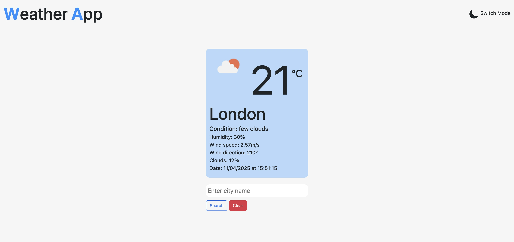

# 100-Days-of-Code - My Journey

**Start Date:** April 09, 2025.
**Goal:** Code for 100 days, track progress, and build real-world skills.

# Introduction 

I started learning to code / programme since 17th of November 2024. I have built little projects to reinforce what I have learnt and have pushed these projects to my github, you can view my <a href='https://github.com/decencyokobia?tab=repositories' target='_blank' title="decency's github repositories">repositories</a>. I have created this repository to document my #100DaysOfCode challenge. Wish me luck! Let's go!

# Day 1 - April 09, 2025.

After sometime I have finally built my own website by refactoring a ready-made template to get my website up and running as well as learn how to modify other people's code and not causing a bug or break in the architecture. My website has an about me section, portfolio, blog and contact pages. I had a great time costomizing it to my own taste. Also I had started learning react since 16th March 2025, so i have created a todolist and an expense tracker multiple times and also learnt how to useState, useEffect (but likely in API request and also tracking changes in my todolist and expense tracker for localstorage purposes) and building reusable UI components (main purpose of react as a javascript library). Since i had to put these on my portfolio, had to learn how to host react projects on github via gh-pages. Finally hosted both after long hours of googling and asking chatGPT questions. It was quite simple when i was doing the next one after the first. 

**learning point:-** 

1. Website creation
2. Build and deployment of react + typescript projects
3. Implementation of localstorage to store todolist and expense tracker data.

**Challenges:**

It was all good stuff all the way. I had challenges while trying to make my react projects live and had to work with JSON files to make that the strict and homepage was all configured to build and deploy my react project. Even after i had finished, I went back to rebuild the todolist and expense tracker to implement localstorge and also configure the files for deployment whuch was a little bit challenging but this time i forced my brain to recall and understand why i had to make what and what. 

**Reflection:-** 

The most interesting part of my journey so far is that 5 months ago, I didn't know how the web worked and now I have started to figure something out and makes me want to learn more. I am excited about learning more about APIs, handling more complex state management in React and soon Next.js to build beautiful web applications.

**Goal:-**

My next goal will be to refresh my mind on how to fetch data with axios using weatherApi free apikey. Hopefully this week and finish my course on how to build a video game fetching app using chakra, but trust me I am taking it slowly as this is the best way I assimilate things.

# Day 2 - April 10, 2025.

Today has been a successful day for me, and I hope the same for you! It's Day 2 of #100DaysOfCode, and I’ve managed to develop a mini weather app. It's not deployed yet, but that's my goal for tomorrow. Aside from coding and developing my technical skills, I've also been focusing on improving my time management. I realized I could easily spend the whole day on my laptop, especially after eating and showering. I tend to avoid distractions like video games, which is a good thing, but I want to strike a better balance.

I came across a concept called the 8-8-8 rule: 8 hours of work, 8 hours of sleep, and 8 hours of leisure with family or friends, or anything non-work related. I didn't fully implement it today, but it's something I'm working towards. Anyway, back to the weather app I built. I’ll share my key takeaways, challenges, reflections, and goals under the following headings:

**learning point:-** 

1. Axios & useEffect:
Axios is a popular library in React used to fetch data, similar to the fetch API in vanilla JavaScript. I’ve used Axios before, so I’m familiar with how to fetch data and handle errors in the console. useEffect is a React hook used to manage side effects, like fetching data. Today, I managed to structure my app by creating a services folder with an api-client.ts and an apiKey.ts file. This modular approach helped keep things clean and organized.

2. AbortController:
This was a new concept for me. The AbortController is used to cancel HTTP requests, which helps prevent unwanted re-renders or remounting due to React's strict implementation. I used it to signal the request cancellation once the data was fetched, making my app more efficient.

3. Weather Icons:
Initially, I thought I’d just hardcode icons based on the weather type. But then, I realized I could use an array to store the icons and dynamically reference them using the index. This was a simple array iteration concept, but with React, I didn’t have to manually loop through as I would in vanilla JavaScript. Also, I learned how to use as keyof typeof for arrays, which helps avoid undefined errors when indexing.
   
**Challenges:**

I encountered some challenges fetching the data today, despite having worked with APIs before. Each API structure is different, so it took a bit of trial and error to map my data correctly. Some responses were arrays of objects, others were objects containing arrays and other objects. I quickly realized that logging the response in the console was essential for understanding the structure and ensuring I defined the correct props. It was a bit frustrating at times, but ultimately, I made it work, and that’s what matters. 

**Reflection:-** 

Looking back, I would make sure to study the structure of the data before trying to fetch it, to better align my props with how the data is structured. There’s always room for improvement, but I’m proud of the progress I made today. One of the highlights was using React Hook Form and Bootstrap to create a dynamic input field, which allowed me to change the city in the weather app without hardcoding values. I had a similar experience while working on my expense tracker project, so it felt great to apply what I learned in one project to another seamlessly. To me, programming is all about taking an idea, explaining it clearly (even to yourself), and then implementing it with the right tools. If you can break it down, you can build it.

**Goal:-**

My next goal is to deploy the weather app and refine it a bit before pushing it to GitHub Pages. I’m not focusing too much on UI/UX right now, but I’ll make sure to fine-tune it tomorrow before the deployment. I’ve also got my MSc project to consider, but for now, I’m staying motivated and pushing forward. No giving up!

# Screenshot of the weather app

# Day 3 - April 11, 2025.

Today I focused on improving the UX/UI of my weather app. I implemented local storage for better state persistence and added a toggle for switching between light and dark modes. I also moved away from a static array of weather icons and instead now fetch icons dynamically from the API — way cleaner and more efficient. 

**learning point:-** 

A big highlight was learning how to fetch temperature values directly in Celsius using API parameters, which saved me from doing manual math conversions. I also got deeper into error handling, learned to interpret console responses more effectively, and implemented a custom alert system.

<a href='https://decencyokobia.github.io/weather-app/' title='my weather app link for live demo'>Access my weather app here</a>

**Challenges:**

Today wasn’t too challenging compared to yesterday. The only hiccup was figuring out how to separate API calls from the rest of the app structure — specifically creating a custom hook for HTTP requests, error handling, and loading states. I didn’t Google anything; just tried to jog my memory and experiment through trial and error. Eventually, I nailed it: separated the API key, created a custom hook, and got it all working smoothly.

**Reflection:-** 

Honestly, I’m proud of how far I’ve come. I’m especially happy that everything is functional and that I was able to cleanly separate concerns in my code — HTTP requests are no longer tangled into my main app logic. That feels like a solid dev move and a step in the right direction toward writing more scalable, maintainable code.

**Goal:-**

Next up, I want to wrap up my video game fetching app as part of my course. Not gonna lie, I find following tutorials a bit boring lately, but I’m pushing through because I know it’s all part of the process. The goal is to complete it so I can finally move on to learning and building with Next.js — I’m hyped about building more robust, full-stack applications.

Also, on the content front: I’ve started posting on Twitter daily, aiming for 2–3 times a week on LinkedIn, and once a week on my blog. My GitHub logs will continue daily — no excuses, even on workdays.

# Day 4 - April 12, 2025.

Today was a mixed bag. I started the day with a clear set of goals: add a filter to my todo list, implement a clear button, add a date to my expense tracker, attempt a progress bar or pie chart, ensure everything used local storage, and work on my recipe app. Sadly, I didn’t touch the video app at all—feeling a bit bad about that, but hey, I’m just a tired man trying to make it. 😅

**learning point:-** 

The highlight was the recipe app. I integrated the Spoonacular API and had to dive into the documentation, which turned out to be a great learning experience. I haven’t done much UI-wise yet, but I did manage to set up an input field that dynamically changes the recipe based on user input—pretty much using the same logic as my weather API and expense tracker. And it worked! Always feels good when the logic holds up.

**Challenges:**

Today hit me with some roadblocks. I really wanted to figure things out myself without jumping straight to Google, and while that helped me learn, it also slowed me down. I couldn’t get the filter on the todo list to work, no matter what logic I tried. The only thing I successfully implemented was the clear button, so I focused on that, updated the UI, uploaded the new screenshot to my website, and made sure everything was synced with GitHub.

I also added the date feature to my expense tracker—thankfully, that was smooth sailing since I’ve worked with the Date object before. I tried to implement a progress bar or pie chart for the tracker too, but it just didn’t look right. So I pushed what I had and updated my site. Definitely felt a bit frustrated not hitting all my goals today.

**Reflection:-** 

Not gonna lie—I felt a bit rubbish not being able to implement the filter or the progress bar. It had me questioning myself like, “Do I even know what I’m doing?” 😅 But on the flip side, getting the recipe app to fetch properly was a win. Small victories, right?

Oh, and I finally set up my Upwork account! Everything’s ready to go, but imposter syndrome is hitting hard. Still doesn’t feel like I’m "ready" to take on gigs, but I guess we’ll see in the coming weeks. One step at a time—we keep pushing.

**Goal:-**

Top priority is to figure out how to implement that filter on the todo list and properly display a progress bar or chart on the expense tracker. I also want to finish my React course, especially the section on fetching video games, so I don’t waste more time stuck in the same spot. Keeping it moving, one day at a time.

